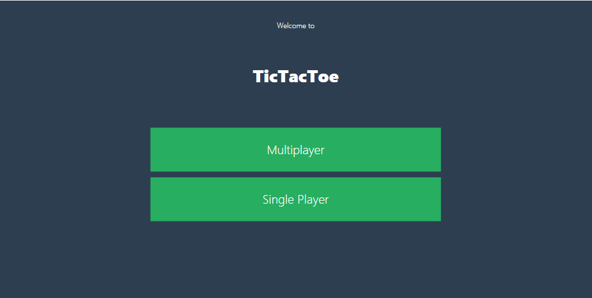
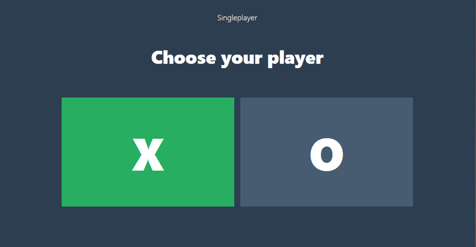
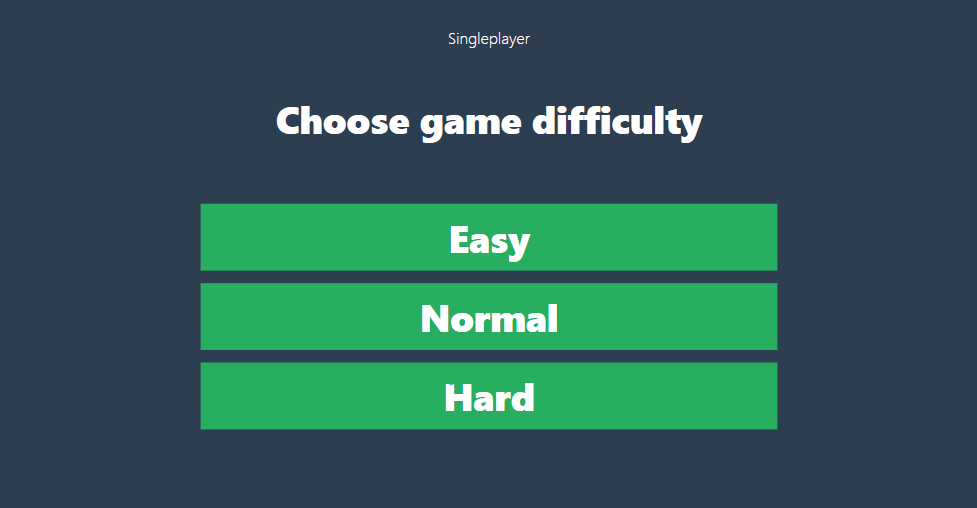
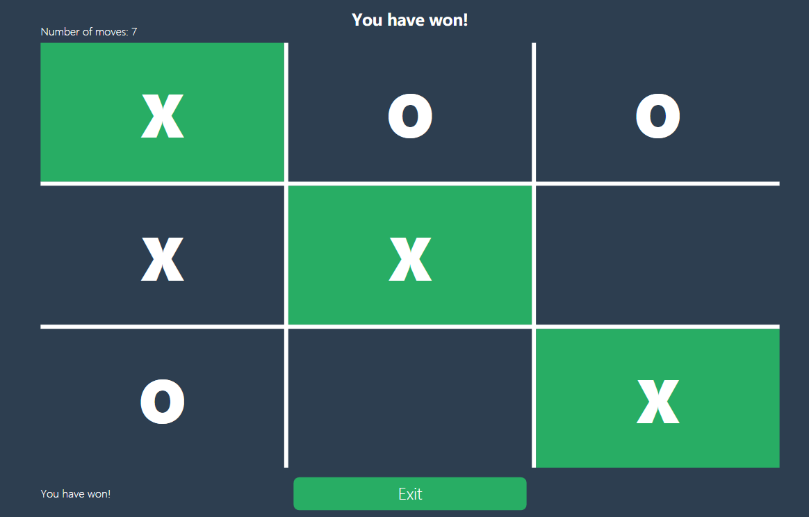

# TicTacToe With Minimax AI Algorithm 

<p align="left">
  &nbsp;&nbsp;&nbsp;&nbsp;
  &nbsp;&nbsp;&nbsp;&nbsp;
  &nbsp;&nbsp;&nbsp;&nbsp;
  
</p>

# Technologies 
This is a Visual Studio 2019 project written in C#.

# Minimax algorithm
The min max algorithm in AI, popularly known as the minimax, is a backtracking algorithm used in decision making, game theory and artificial intelligence (AI). It is used to find the optimal move for a player, assuming that the opponent is also playing optimally.

The algorithm will check all the possibilities for player and for the opponent and return the most optimal path to win or prevent the opponent from winning.

You can read more [here.](https://www.geeksforgeeks.org/minimax-algorithm-in-game-theory-set-3-tic-tac-toe-ai-finding-optimal-move/) 

## Pseudocode
```
function findBestMove(board):
    bestMove = NULL
    for each move in board :
        if current move is better than bestMove
            bestMove = current move
    return bestMove
    
function minimax(board, depth, isMaximizingPlayer):
    if current board state is a terminal state :
        return value of the board

    if isMaximizingPlayer :
        bestVal = -INFINITY 
        for each move in board :
            value = minimax(board, depth+1, false)
            bestVal = max( bestVal, value) 
        return bestVal

    else :
        bestVal = +INFINITY 
        for each move in board :
            value = minimax(board, depth+1, true)
            bestVal = min( bestVal, value) 
        return bestVal 
```
## Implementation
This is part of the code:
```csharp
int Minimax(array, isMaximizing, depth) 
{
    /* if we don’t want to go through all the possibilities, we simply stop the algorithm. 
    This is good for different diffucilties in the game.*/ 
    if (depth == maxDepth)
    {
        return 0;
    }
    
    char winner = CheckWinner(array); /* this will return either 'X', 'O' or 'tie' */
    if (winner != '/')
    {
        return GetScore(winner); /* this will return +10 for player, -10 for opponent and 0 for tie */
    }
    
    if (isMaximizing) /* we are maximizing possibilities for player to win */
    {
        int bestScore = int.MinValue;
        for (int i = 0; i < 9; i++) /* go through the array */
        {
            if (array[i] == '-') /* check if place is empty/available */
            {
                array[i] = player;  /* place 'x' on board */

                int score = Minimax(array, depth + 1, false); /* after maximizing, we start minimizing */

                array[i] = '-'; /* remove 'x' from board */

                if (score > bestScore)
                {
                    bestScore = score;
                }
            }
        }
        return bestScore;
    }
    else /* we are minimizing possibilities for opponent to win */
    {
        int bestScore = int.MaxValue;
        for (int i = 0; i < 9; i++) /* we go through the array */ 
        {
            if (array[i] == '-') /* check if place is empty/available */
            {
                array[i] = opponent; /* place 'o' on board */

                int score = Minimax(array, depth + 1, true); /* after minimizing, we start maximizing */

                array[i] = '-'; /* remove 'x' from board */

                if (score < bestScore)
                {
                    bestScore = score;
                }
            }
        }
        return bestScore;
    }
}

private int GetScore(char player)
{
    if (this.player == player)
    {
        return +10;
    }
    else if (this.opponent == player)
    {
        return -10;
    }
    else
    {
        return 0;
    }
}
```
